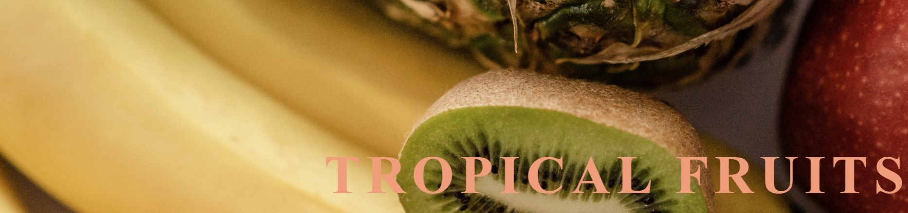
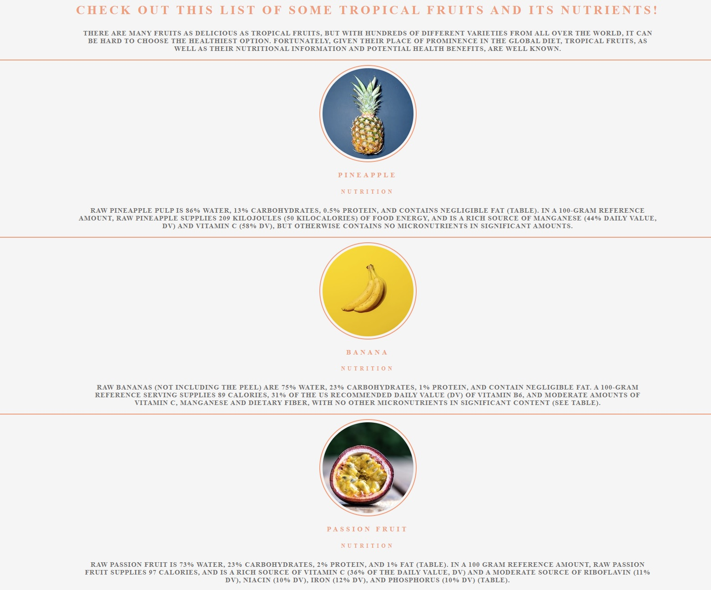
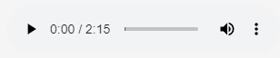
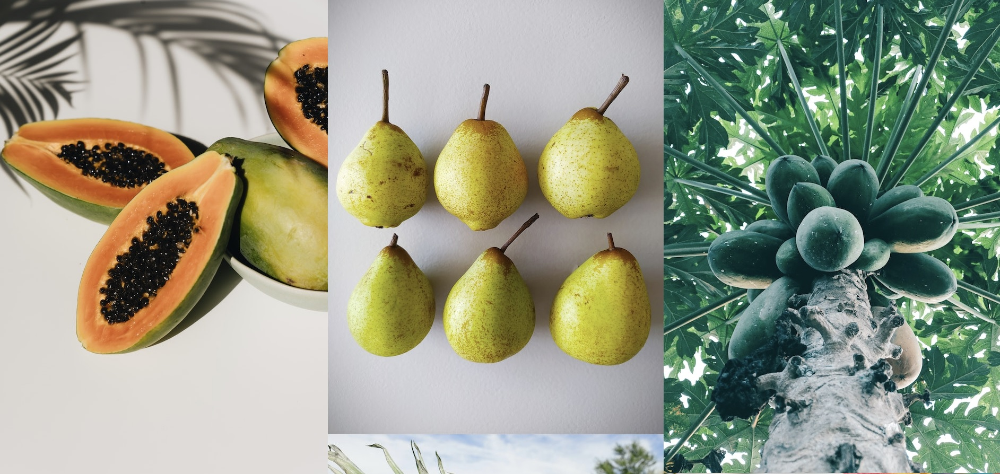
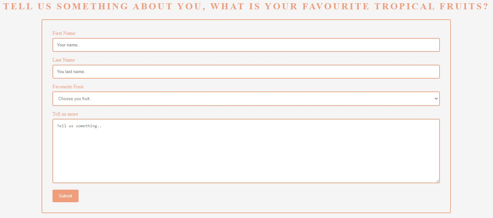

# Tropical Fruits

Tropical Fruits is a simple site that can be used to read about the nutritions of exotic fruits of the world. 

You can also look at some nice images in the gallery section and fill in a form to let us know what's your favourite fruit.

You'll also get some nice background audio of waves when browsing this site.

# Features

If you love tropical fruits, this site is for you. It provides you with some information about the nutriotional benefits, some delicious images and a contact page to fill in a form to let us know about you and your love for fruits.

## Existing Features

* Navigation Bar
  - The navigation bar is responsive on each page on the site, clicking the logo will take you to the home page.
  - It makes the user able to navigate throughout the site from each of the pages easily.

* The landing page image
  - This includes an image of some tropical fruits and a logo of Tropical Fruits.
  - You can click this image or logo to get to the home page whichever page you're on.

* List of fruits
  - In this list you can read about some fruits and its nutriotional information.

* Audio player
  - This audio player will autoplay sounds of waves whenever you enter the site.

* Footer
  - This is the footer of the page, it lets the user know that we're on social media and that they can click on the links to get to the pages in new tabs.

* Delicious Fruits page
  - This site will give the user some nice images of fruits.

* Contact us page
  - This page will allow the user to get in touch with us to let us know more about them, what fruits they like and if they want, more information about their connection to tropical fruits.

## Future Feature ideas

* Add more fruits to the list of fruits and its nutriotions.
* Add additional information of each fruit, some recipes for smoothies etc.
* Add more images to the Delicious Fruits gallery.

# Testing

## Different browser and screen sizes test

* Browsers
  - Google Chrome
    - Works well, no errors.
  - Mozilla Firefox
    - Works well, no errors.
  - Microsoft Edge
    - Works well, no errors.

* Screen sizes 
  - I've used chrome devtools to help manage the media queries for most of the devices devtools provide for this site.
  - I've also used my own mobile phone to really help me with the media queries.

## Validator testing

* HTML
  - No errors when using [W3C validator](https://validator.w3.org/nu/#textarea)

* CSS
  - Just one error occured when using CSS validator, the font im using is not a font-family value. But its working so im using it anyway [W3C validator](https://jigsaw.w3.org/css-validator/validator)

# Deployment

* I used GitHub pages to deploy this site. Here are the steps i used:
  - Navigate to the settings tab in the repository.
  - Open the pages section and use the drop-down menu in the branch part and select Main Branch.
  - Once its selected, refresh the page to see its been a successful deployment.

Link to the live page can be found here: [Link to Tropical Fruits website](https://mysanthropium.github.io/project1/index.html)

# Credits

## Content

* The fonts I used for the site are from [Google Fonts](https://fonts.google.com/)
* The underline look idea for the nav bar was taken from the Love Running tutorial.
* The idea for the circle images in the fruits list I got from the Love Running tutorial.

## Media

* The idea for the image gallery in delicious fruits page I got from the Love Running tutorial, I tried to play around with image grids aswell but I really liked the look of the gallery.
* All photos on the webpage was taken from [Pexels](https://www.pexels.com/search/free/)

